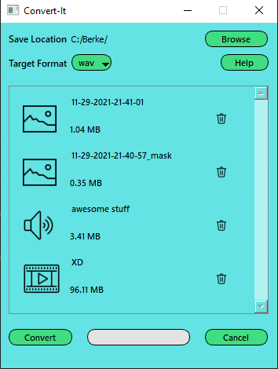

# Convert-It

GUI application to convert your media files.

You can convert image, video and audio files
Supported conversion operations are listed below
- video-video
- image-image
- audio-audio
- video-audio
- gif from videos

### How to Use
- Install ffmpeg
- Install modules at requirements.txt
- Run convert-it.py

You can drag&drop the media files you wish to convert

